Addressing the elephant in the blue-green room: Data synchronisation for blue-green deployment using CockroachDB
================================================================================================================

 

Azrul MADISA

 

09-JAN-2021

 

Introduction
------------

Blue green deployment is one of the ideal pattern (if I can call it that) of
continuous deployment. Martin Fowler describes the workings of blue green
deployment well [<https://martinfowler.com/bliki/BlueGreenDeployment.html>].
Citing him:

 

>    The blue-green deployment approach does this by ensuring you have two
>   production environments, as identical as possible. At any time one of them,
>   let's say blue for the example, is live. As you prepare a new release of
>   your software you do your final stage of testing in the green environment.
>   Once the software is working in the green environment, you switch the router
>   so that all incoming requests go to the green environment - the blue one is
>   now idle.

 

Sounds simple enough. But Martin Fowler also describes the challenges of having
to synchronise data across blue and green

 

>   Databases can often be a challenge with this technique, particularly when
>   you need to change the schema to support a new version of the software

 

The challenge here is three folds: For one, how would you update the database
schema of a software that is still running?

So, imagine you have blue and green production environment. Let us say that blue
is live and green is being updated - and the update could involved the database
also. Once green is fully deployed, it will be tested in production - usually
with real production usage. In which case, (and our second challenge) how would
we make sure the data and transactions captured by green is also available in
blue? Remember, this is production environment. We cannot just ’throw away’ data
as it could be an audit concern. In a regulated industry (banking for example),
throwing away data from green could be a regulatory violation.

Thirdly, while green is being tested, blue is actually live. New data
transactions are coming to it all the time. How would we make sure that data
committed to blue, is also available in green since green will be the future
live system?

 

Of course, one easy way to solve the database problem is to work with a single
database and both blue and green would talk to this single database. This
approach seems risky. If any update to the database actually breaks it, we will
end up affecting the live (blue) application also. So we propose distributing
the database across blue and green environment.

 

In this article we will try to solve this database distribution problem using
pattern of database replication called Primary-Primary distribution. We find
that, CockroachDB offers an excellent implementation of this pattern and also
allow us to make changes to the schema on the fly and thus solving our first
challenge above.

 

Primary-Primary (or Multi-Primary) vs. Primary-Replicant
--------------------------------------------------------

There are two main pattern to distribute a database. Primary-Primary vs.
Primary-Replicant

In a primary-replica setup, a replica database is created. The replica database
would only receive read queries. Any update, create or delete query will go to
the primary. Changes that happens to the primary database is propagated to the
replicant database.

 

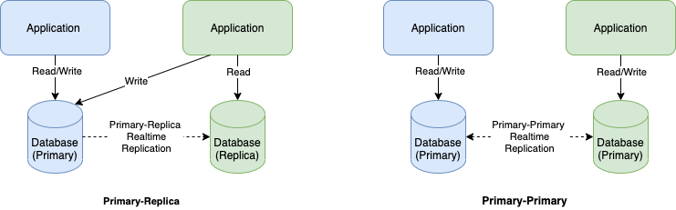

 

As you can see, this will allow us to distribute read I/O across multiple
replica databases and thus lighten the burden of the primary database. Given
that most queries are “read” in nature, this makes perfect sense.

 

A primary-primary setup on the other hand allow both read and write to happen in
both instances of the database. The primaries will update each other of the
changes.

 

As you can see, a primary-primary setup is more challenging to implement as
updates can go both ways between the primaries. But, this is perfect for our
blue green deployment.

 

Primary-primary and blue-green deployment
-----------------------------------------

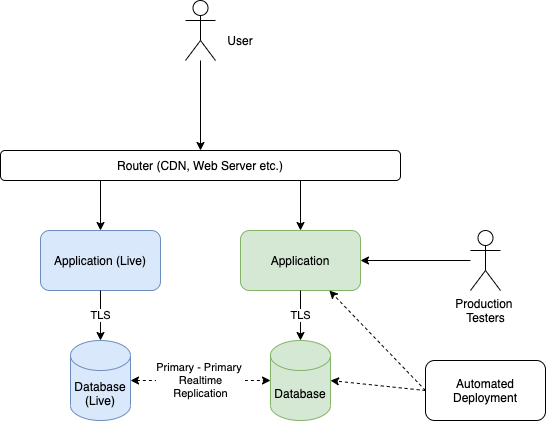

 

In a blue-green setup, we will have the architecture proposed above.

 

1.  Blue is live and is currently serving our users.

2.  Green is being updated through automated deployment (in actual fact, it
    doesn’t have to be automated). The update will involved both database and
    application

3.  Note that while deployment to green is happening, actual data and
    transactions are coming in through blue. These will be sync up to green
    automatically

4.  At the same time, any update to the database schema in green is propagated
    to blue directly. Because of this, the **update done to the database in
    green must be backward compatible**

5.  Once update is ready, a production tester (usually a subset of actual users)
    are going to test the application using real production data/transactions
    (not dummy data)

6.  Note that the real production test data coming from green will be
    synchronised to blue directly

7.  We will need to fix any production related issues and redeploy. This means
    that we may need to be careful with the production test cases we ran at
    green. If that data is committed, we may care about application state.
    Imagine that the application is a workflow application. The production test
    data that we committed at green, move the workflow from step A to step B. If
    things go wrong and we need to retest, we may need to take into account that
    the workflow is now in step B - which may not be our assumption.

8.  Once we are happy, we will use our router to route the traffic from blue to
    green - and green will be, in turn, live

9.  In our next deployment, blue will be updated just as green is this time
    around.

 

In this article, we will concentrate on the database update part. We will not
address the router switching bit as there are many articles addressing this
already.

 

CockroachDB
-----------

 

CockroachDB by Cockroach Labs [<https://www.cockroachlabs.com/>] is a very
resilient RDBMS inspired by Google Spanner. It allows global level multi primary
replication. Primary-primary replication is considered first class citizen
rather than some additional afterthought that needs some super expensive plugins
to implement. Things we like about CockroachDB that makes it ideal for
blue-green setup

 

1.  Database is distributed by default - primary-primary topology

2.  Very resilient to online schema change (and this is how
    <https://www.cockroachlabs.com/blog/how-online-schema-changes-are-possible-in-cockroachdb/>)

 

In addition, CockroachDB:

 

1.  Is fully SQL

2.  Is CP (as in CAP theorem)

3.  Supports TDE

4.  Supports TLS communication

5.  Is open source

 

What will we do in this article
-------------------------------

The goal of this article is to show how to run a blue-green deployment -
concentrating on data and the database.

We will first setup a blue part of our infra-structure. We will then setup
monitoring to see the baseline performance of our app. Once this is established,
under the same monitoring, we will enact green deployment (including schema
change) and see what is the impact of that deployment in blue. Finally, we will
run both blue and green in parallel to see how one affect the other.

 

Setting up the database
-----------------------

In this article, we are setting up 3 instances of CockroachDB in the same
machine (my humble laptop). They will work on different ports but having the
same hostname. Because of this, we will share the same TLS certificate. In a
real world setup, there will be 3 servers (which could be
multi-availability-zones or multi-regions), each with a different hostname. And
therefore we will need 3 different certificates.

 

### Directory structure

Our directory structure will look like below:

\$BLUEGREEN

\|—certs

\|—my-safe-directory

\|—node1

\|—node2

\|—node3

 

### CockroachDB installation

-   Firstly, we will need to install CockroachDB. You may want to follow the
    tutorial published on Cockroach Lab’s site. I am using a Mac so I will be
    following the steps here
    <https://www.cockroachlabs.com/docs/v20.2/install-cockroachdb-mac.html>.
    There are also tutorials for Windows, Linux, Kubernetes and Docker.

-   Next, follow the tutorial here
    <https://www.cockroachlabs.com/docs/stable/secure-a-cluster.html> to create
    a TLS secured cluster. Note that the directories node1, node2 and node3
    above are for the respective nodes in the cluster

-   Once done, run each node of the cluster. Point our command line console to
    \$BLUEGREEN and run:

~~~~~~~~~~~~~~~~~~~~~~~~~~~~~~~~~~~~~~~~~~~~~~~~~~~~~~~~~~~~~~~~~~~~~~~~~~~~~~~~
> cockroach start \
--certs-dir=certs \
--store=node1 \
--listen-addr=localhost:26257 \
--http-addr=localhost:8080 \
--join=localhost:26257,localhost:26258,localhost:26259 \
--background
~~~~~~~~~~~~~~~~~~~~~~~~~~~~~~~~~~~~~~~~~~~~~~~~~~~~~~~~~~~~~~~~~~~~~~~~~~~~~~~~

 

~~~~~~~~~~~~~~~~~~~~~~~~~~~~~~~~~~~~~~~~~~~~~~~~~~~~~~~~~~~~~~~~~~~~~~~~~~~~~~~~
> cockroach start \
--certs-dir=certs \
--store=node2 \
--listen-addr=localhost:26258 \
--http-addr=localhost:8081 \
--join=localhost:26257,localhost:26258,localhost:26259 \
--background
~~~~~~~~~~~~~~~~~~~~~~~~~~~~~~~~~~~~~~~~~~~~~~~~~~~~~~~~~~~~~~~~~~~~~~~~~~~~~~~~

 

~~~~~~~~~~~~~~~~~~~~~~~~~~~~~~~~~~~~~~~~~~~~~~~~~~~~~~~~~~~~~~~~~~~~~~~~~~~~~~~~
> cockroach start \
--certs-dir=certs \
--store=node3 \
--listen-addr=localhost:26259 \
--http-addr=localhost:8082 \
--join=localhost:26257,localhost:26258,localhost:26259 \
--background
~~~~~~~~~~~~~~~~~~~~~~~~~~~~~~~~~~~~~~~~~~~~~~~~~~~~~~~~~~~~~~~~~~~~~~~~~~~~~~~~

-   Create a user named ‘banking'. Firstly, point your command line console to
    \$BLUEGREEN and launch the CockroachDB client:

~~~~~~~~~~~~~~~~~~~~~~~~~~~~~~~~~~~~~~~~~~~~~~~~~~~~~~~~~~~~~~~~~~~~~~~~~~~~~~~~
> cockroach sql --certs-dir=certs --host=localhost:26257
~~~~~~~~~~~~~~~~~~~~~~~~~~~~~~~~~~~~~~~~~~~~~~~~~~~~~~~~~~~~~~~~~~~~~~~~~~~~~~~~

-   You will get the CockroachDB client. Run the command to create ‘banking’
    user:

~~~~~~~~~~~~~~~~~~~~~~~~~~~~~~~~~~~~~~~~~~~~~~~~~~~~~~~~~~~~~~~~~~~~~~~~~~~~~~~~
root@:26257/defaultdb> CREATE USER banking WITH LOGIN PASSWORD 'somepassword'
~~~~~~~~~~~~~~~~~~~~~~~~~~~~~~~~~~~~~~~~~~~~~~~~~~~~~~~~~~~~~~~~~~~~~~~~~~~~~~~~

-   Create database ’banking'

~~~~~~~~~~~~~~~~~~~~~~~~~~~~~~~~~~~~~~~~~~~~~~~~~~~~~~~~~~~~~~~~~~~~~~~~~~~~~~~~
root@:26257/defaultdb> CREATE DATABASE banking
~~~~~~~~~~~~~~~~~~~~~~~~~~~~~~~~~~~~~~~~~~~~~~~~~~~~~~~~~~~~~~~~~~~~~~~~~~~~~~~~

-   Assign the database ‘banking’ to the user ‘banking'

~~~~~~~~~~~~~~~~~~~~~~~~~~~~~~~~~~~~~~~~~~~~~~~~~~~~~~~~~~~~~~~~~~~~~~~~~~~~~~~~
root@:26257/defaultdb> alter database banking owner to banking
~~~~~~~~~~~~~~~~~~~~~~~~~~~~~~~~~~~~~~~~~~~~~~~~~~~~~~~~~~~~~~~~~~~~~~~~~~~~~~~~

-   Log out, add certs for banking. The cert is specific to a user

~~~~~~~~~~~~~~~~~~~~~~~~~~~~~~~~~~~~~~~~~~~~~~~~~~~~~~~~~~~~~~~~~~~~~~~~~~~~~~~~
 > cockroach cert create-client \
    banking \
    --certs-dir=certs \
    --ca-key=my-safe-directory/ca.key
~~~~~~~~~~~~~~~~~~~~~~~~~~~~~~~~~~~~~~~~~~~~~~~~~~~~~~~~~~~~~~~~~~~~~~~~~~~~~~~~

-   Create pk8 file:

~~~~~~~~~~~~~~~~~~~~~~~~~~~~~~~~~~~~~~~~~~~~~~~~~~~~~~~~~~~~~~~~~~~~~~~~~~~~~~~~
> openssl pkcs8 -topk8 -inform PEM -outform DER -in certs/client.banking.key -out certs/client.banking.pk8
~~~~~~~~~~~~~~~~~~~~~~~~~~~~~~~~~~~~~~~~~~~~~~~~~~~~~~~~~~~~~~~~~~~~~~~~~~~~~~~~

If asked for password, just put something

 

 

 

### CockroachDB setup

-   We use DBeaver <https://dbeaver.io/> as a GUI client to access CockroachDB.
    Download it, install and run

-   Under DBeaver, click on File -\> New. Choose DBeaver -\> Database Connection

-   Choose CockroachDB, and click Next

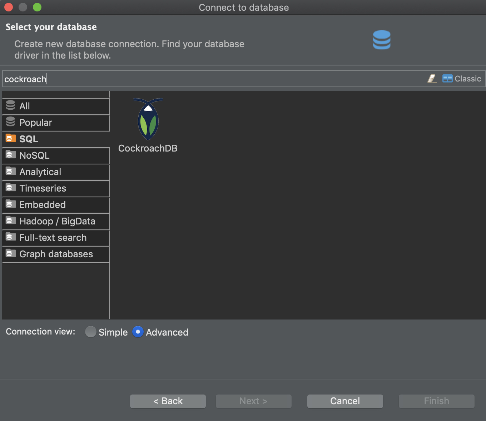

-   In the settings:

    -   host = localhost

    -   database = banking

    -   username = banking

    -   password = somepassword

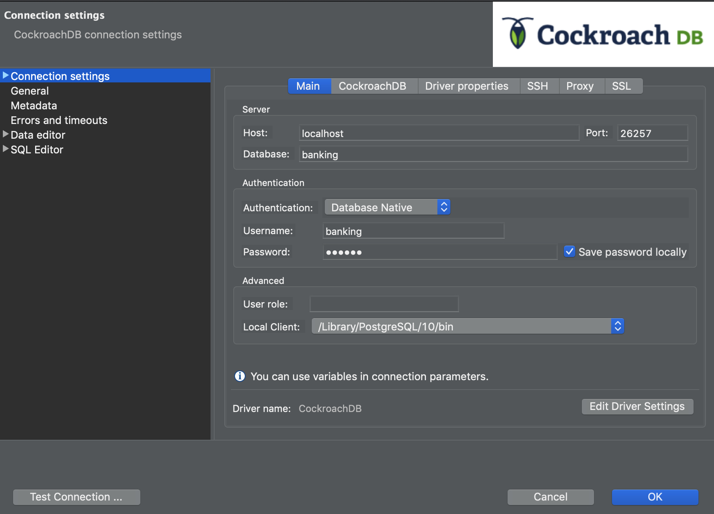

-   We can test the connection with the ’Test Connection …’ button. Once done,
    click OK

-   Next, we will land on the main interface of DBeaver. Then, choose the New
    SQL Editor from the main menu

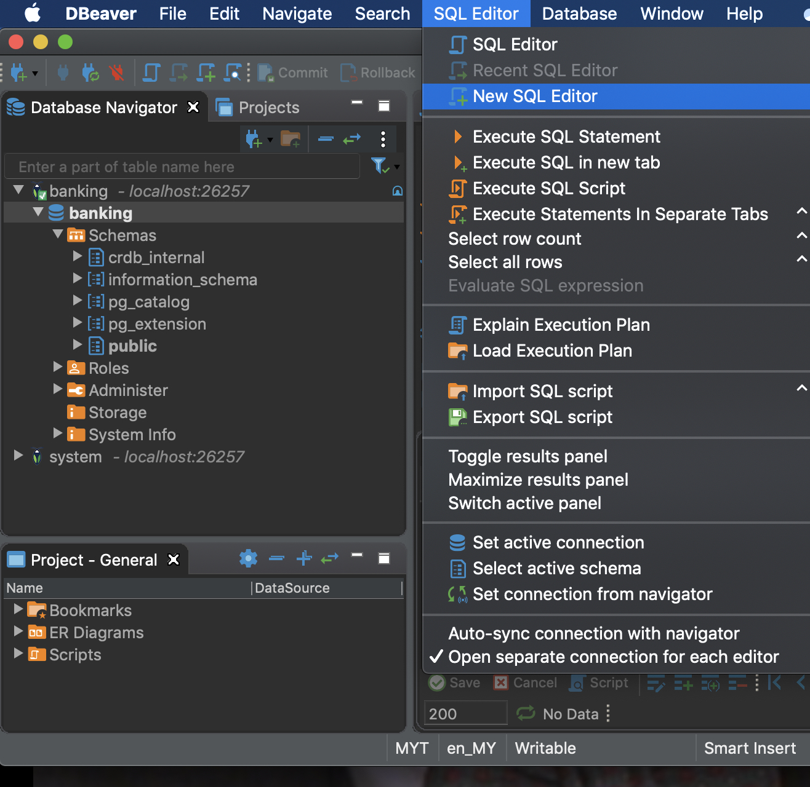

-   You will get an SQL Editor. If the password is asked, then just enter it

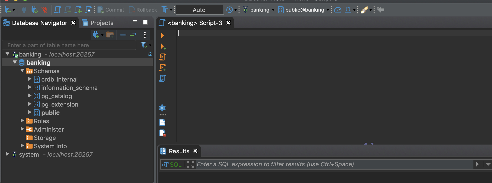

 

-   In the SQL Editor, run the DDL script below:

 

~~~~~~~~~~~~~~~~~~~~~~~~~~~~~~~~~~~~~~~~~~~~~~~~~~~~~~~~~~~~~~~~~~~~~~~~~~~~~~~~
CREATE TABLE public.account (
        accountnumber VARCHAR(20) NOT NULL,
        product VARCHAR(20) NULL,
        friendlyname VARCHAR(100) NULL,
        balance DECIMAL(10,2) NULL,
        CONSTRAINT account_pk PRIMARY KEY (accountnumber ASC),
        FAMILY "primary" (accountnumber, product, friendlyname, balance)
);

CREATE TABLE public.transaction (
            transactionid VARCHAR(40) NOT NULL,
            fromaccount VARCHAR(20) NULL,
            toaccount VARCHAR(20) NULL,
            amount DECIMAL(10,2) NULL,
            datetime TIMESTAMP(0) NULL,
            CONSTRAINT "primary" PRIMARY KEY (transactionid ASC),
            CONSTRAINT transaction_fk FOREIGN KEY (fromaccount) REFERENCES public.account(accountnumber),
            CONSTRAINT transaction_fk_1 FOREIGN KEY (toaccount) REFERENCES public.account(accountnumber),
            INDEX transaction_datetime_idx (datetime ASC),
            FAMILY "primary" (transactionid, rowid, fromaccount, toaccount, amount, datetime)
);
~~~~~~~~~~~~~~~~~~~~~~~~~~~~~~~~~~~~~~~~~~~~~~~~~~~~~~~~~~~~~~~~~~~~~~~~~~~~~~~~

-   This will create the account and transaction tables. Our database is now
    setup for use

 

Setting up and running the blue micro-service
---------------------------------------------

 

### Code and logic

The source code for our blue micro-service is hosted here
<https://github.com/azrulhasni/bluegreen/tree/main/BlueGreenBanking/>

 

You can download it into the \$BLUEGREEN folder.

The logic is quite straight forward. We expose an end point called /transfer.
Transfer will take in two accounts, one to be credited, one to be debited. We
would then credit into one account and debit from another account and returns
the origin account.

 

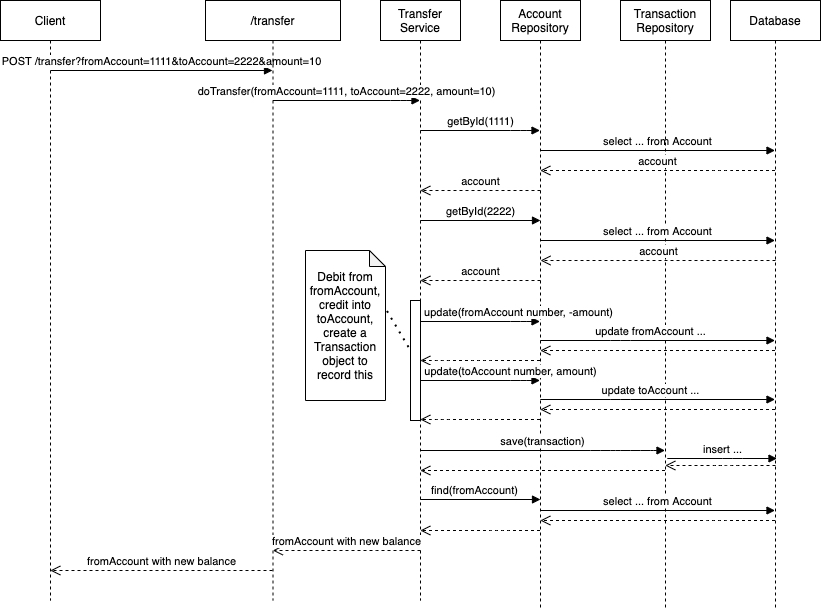

Some configuration:

| **Configuration** | **File**               | **Property**          | **Value**                                                          |
|-------------------|------------------------|-----------------------|--------------------------------------------------------------------|
| port              | application.properties | server.port           | 18081                                                              |
| JDBC URL\*        | application.properties | spring.datasource.url | jdbc:postgresql://localhost:26257/banking?ssl=true&sslmode=require |

 

\* Note that we are connecting to one of the node of the database (26257). We
also put sslmode=require to ensure that the connectivity to the node is
protected by TLS.

 

 

 

### Generating data

-   We supply a component called InitComponent that can be used to generate data

~~~~~~~~~~~~~~~~~~~~~~~~~~~~~~~~~~~~~~~~~~~~~~~~~~~~~~~~~~~~~~~~~~~~~~~~~~~~~~~~
@Component
public class InitComponent {
     @Autowired
    private AccountRepository accountRepo;
    
     //@PostConstruct
    public void init(){
        String pattern = "00000000";
        DecimalFormat df = new DecimalFormat(pattern);
        for (int i=0;i<2500000;i++){
            Account account = new Account();
            account.setAccountnumber("A"+df.format(i));
            account.setBalance(new BigDecimal("5999999.99"));
            account.setFriendlyname("My day-to-day account");
            account.setProduct("Saving account");
            accountRepo.save(account);
        }
    }
}
~~~~~~~~~~~~~~~~~~~~~~~~~~~~~~~~~~~~~~~~~~~~~~~~~~~~~~~~~~~~~~~~~~~~~~~~~~~~~~~~

-   The annotation PostConstruct is commented out. We can un-comment it and run
    the micro-service (as per the next paragraph) to generate data.

-   Do note that we tried to generate 2,500,000 rows of data. Each Account has a
    number A+counter.

 

**Note that generating data could take a while. On my own laptop, it took a few
days to generate 2,500,000 rows!**

 

### Running and and testing of blue micro-service

-   Fire up our command line console and point it to
    \$BLUEGREEN/BlueGreenBanking and run:

~~~~~~~~~~~~~~~~~~~~~~~~~~~~~~~~~~~~~~~~~~~~~~~~~~~~~~~~~~~~~~~~~~~~~~~~~~~~~~~~
> mvn "-Dspring-boot.run.jvmArguments=-noverify -XX:TieredStopAtLevel=1" -Dspring-boot.run.mainClass=com.azrul.ebanking.Transfer.TransferApplication spring-boot:run
~~~~~~~~~~~~~~~~~~~~~~~~~~~~~~~~~~~~~~~~~~~~~~~~~~~~~~~~~~~~~~~~~~~~~~~~~~~~~~~~

-   You will get the message below which means everything is good and dandy

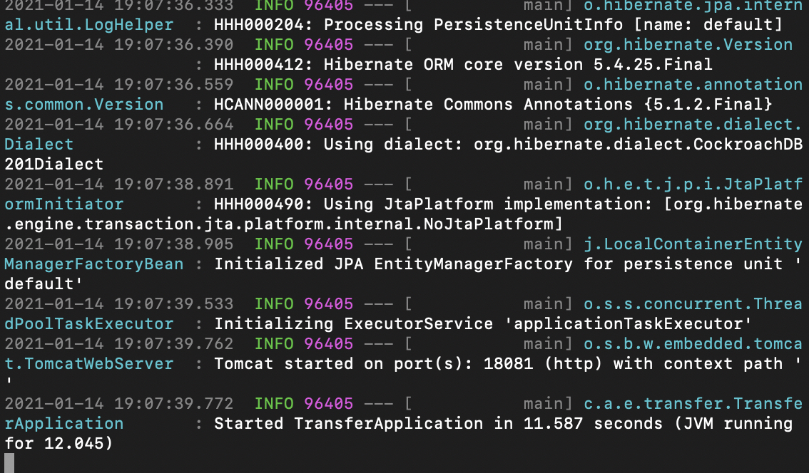

-   Fire up another command line console window and run the curl command below:

~~~~~~~~~~~~~~~~~~~~~~~~~~~~~~~~~~~~~~~~~~~~~~~~~~~~~~~~~~~~~~~~~~~~~~~~~~~~~~~~
> curl --location --request POST 'localhost:18081/transfer?fromAccountNumber=1111&toAccountNumber=2222&amount=1' \
> --header 'Content-Type: application/json' \
~~~~~~~~~~~~~~~~~~~~~~~~~~~~~~~~~~~~~~~~~~~~~~~~~~~~~~~~~~~~~~~~~~~~~~~~~~~~~~~~

-   You should get something similar to:

~~~~~~~~~~~~~~~~~~~~~~~~~~~~~~~~~~~~~~~~~~~~~~~~~~~~~~~~~~~~~~~~~~~~~~~~~~~~~~~~
{"accountnumber":"1111","product":"Classic Saving","friendlyname":"My salary account","balance":999998.00}
~~~~~~~~~~~~~~~~~~~~~~~~~~~~~~~~~~~~~~~~~~~~~~~~~~~~~~~~~~~~~~~~~~~~~~~~~~~~~~~~

 

### Load testing the blue micro-service

-   We will use JMeter to load test our blue micro-service. The script can be
    found here <https://github.com/azrulhasni/bluegreen/blob/main/BlueTest.jmx>

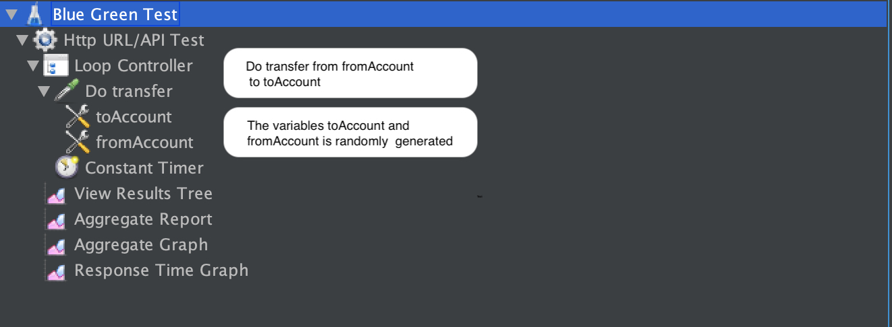

-   The test will run 500 threads for an hour with ramp up time of 10 seconds.
    We program a 10 second think time in between transfer

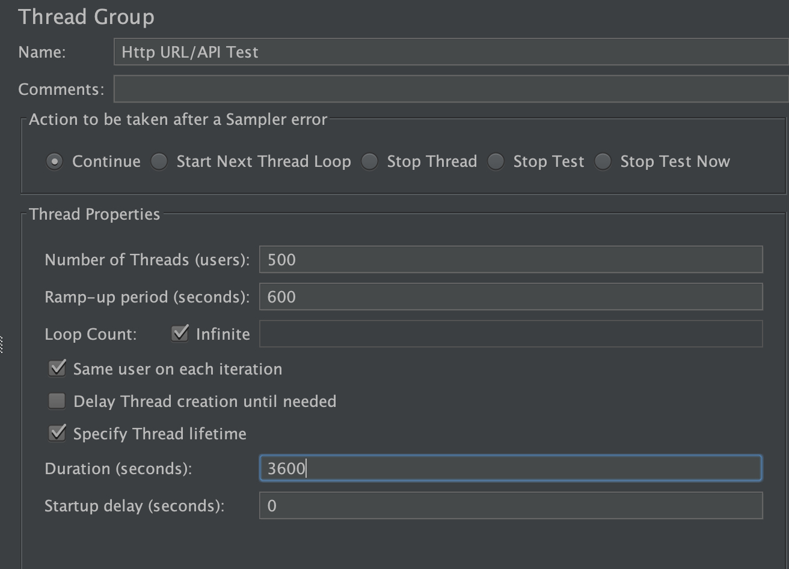

-   Under Response Time Graph, we specify the file where the performance result
    will be saved

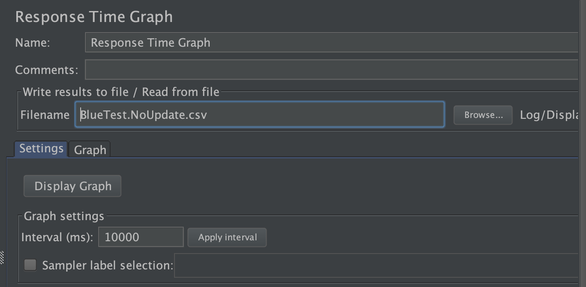

 

### Result

-   Once the test terminated, we can get the Latency data from the
    BlueTest.NoUpdate.csv file as specified above.

-   The distribution of the latency data is as per below:

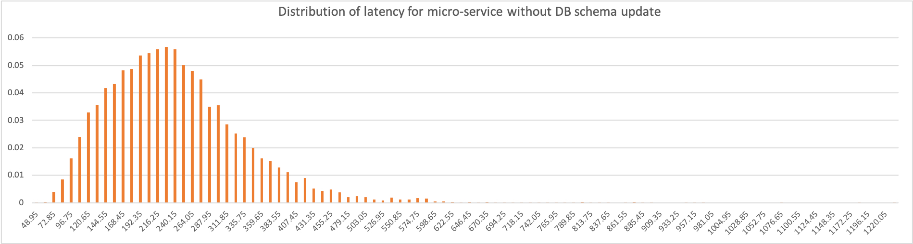

Mean = 234.780541

Standard deviation = 95.1965176

 

Setting up and running the green micro-service
----------------------------------------------

 

### Changes to the database

-   As stated before, the change to the database need to be backward compatible
    (see Backward compatible database changes paragraph).  The changes proposed
    are:

    -   Add table

    ~~~~~~~~~~~~~~~~~~~~~~~~~~~~~~~~~~~~~~~~~~~~~~~~~~~~~~~~~~~~~~~~~~~~~~~~~~~~
        CREATE TABLE public.accounttype
        (
            accounttypeid integer NOT NULL,
            description VARCHAR(20),
            CONSTRAINT accounttype_pkey PRIMARY KEY (accounttypeid ASC),
            FAMILY "primary" (accounttypeid, description)
        )
    ~~~~~~~~~~~~~~~~~~~~~~~~~~~~~~~~~~~~~~~~~~~~~~~~~~~~~~~~~~~~~~~~~~~~~~~~~~~~

    -   Alter account table

    ~~~~~~~~~~~~~~~~~~~~~~~~~~~~~~~~~~~~~~~~~~~~~~~~~~~~~~~~~~~~~~~~~~~~~~~~~~~~
        ALTER TABLE public.account
        ADD COLUMN accounttype integer NOT NULL DEFAULT 0;
    ~~~~~~~~~~~~~~~~~~~~~~~~~~~~~~~~~~~~~~~~~~~~~~~~~~~~~~~~~~~~~~~~~~~~~~~~~~~~

    -   Add relationship

    ~~~~~~~~~~~~~~~~~~~~~~~~~~~~~~~~~~~~~~~~~~~~~~~~~~~~~~~~~~~~~~~~~~~~~~~~~~~~
        ALTER TABLE account ADD CONSTRAINT account_fk FOREIGN KEY (accounttype) REFERENCES accounttype (accounttypeid)
    ~~~~~~~~~~~~~~~~~~~~~~~~~~~~~~~~~~~~~~~~~~~~~~~~~~~~~~~~~~~~~~~~~~~~~~~~~~~~

    -   These changes basically refactor out the column ‘Product’ into another
        table called ‘Accounttype’.

    -   Originally, we wanted to also run an update script below:

    ~~~~~~~~~~~~~~~~~~~~~~~~~~~~~~~~~~~~~~~~~~~~~~~~~~~~~~~~~~~~~~~~~~~~~~~~~~~~
    update account set accounttype = 1 where product='Saving account'
    ~~~~~~~~~~~~~~~~~~~~~~~~~~~~~~~~~~~~~~~~~~~~~~~~~~~~~~~~~~~~~~~~~~~~~~~~~~~~

    Unfortunately, this update script runs for 2 whole days. After resetting the
    database, we decided to exclude it from the actual test presented here as
    the data is just too big to process is mere Excel.

     

### Changes to micro-service

-   The source code for the green micro-service can be found here
    <https://github.com/azrulhasni/bluegreen/tree/main/BlueGreenBanking2>

-   The changes are minimal, we introduced another entity to support the new
    table above and expose its data all the way to our REST API.

 

Configuration:

| **Configuration** | **File**               | **Property**          | **Value**                                                              |
|-------------------|------------------------|-----------------------|------------------------------------------------------------------------|
| port              | application.properties | server.port           | **18082**                                                              |
| JDBC URL          | application.properties | spring.datasource.url | jdbc:postgresql://localhost:**26258**/banking?ssl=true&sslmode=require |

Note that we are running the micro-service on a different port now (18082) and
connecting to a different node of the database (26258)

 

 

### Changes to Jmeter script

-   We increase the load testing time to 2 hours (7200 seconds) as some of our
    alter table scripts need longer than an hour to complete. The modified
    script can be found here
    <https://github.com/azrulhasni/bluegreen/blob/main/BlueTest_au.jmx>

 

 

### Running the load test

-   Now, this is the moment of truth: **we will run the database change scripts
    above while monitoring the performance of our blue micro-service**

-   First, run the Jmeter script above
    (<https://github.com/azrulhasni/bluegreen/blob/main/BlueTest_au.jmx>)

-   It will take 10 minutes for all the 500 threads to be initialized and is now
    load testing our application

-   After that 10 minutes is up, run the database change scripts above. Use
    DBeaver and point to the database node with port 26258.

-   In my humble laptop, the update to the database will take over an hour. Once
    the test is terminated, collect the latency data and plot its distribution
    alongside the original data collected when no database schema update was
    done.

 

### Result

We got the result below:

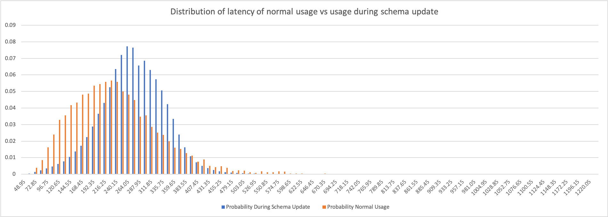

Mean (normal usage)= 234.780541

Standard deviation (normal usage)= 95.1965176

Mean (usage during schema update) = 270.26361 ms

Standard deviation (usage during schema update) = 68.6027212

 

### Conclusion

As you can see, the average latency is affected when the database is update but
the effect is small. What is more important is that the worse case scenario does
not seem to shift all that much. Basically a blue-green deployment does has
practically no impact as worst case scenario and shifted the average just by a
little bit.

 

Running both blue and green together
------------------------------------

Once we deployed the green micro-services, we can run it along side blue and
load test them both just to see how they fare. Of course, in reality, you will
not run blue and green concurrently for long. We would do some production test
on green and sunset blue instead.

 

The Jmeter script to test both can be found here

 

 

Backward compatible database changes
------------------------------------

-   Add table

-   Add view

-   Add columns to existing tables - column must be optional OR has default

    -   The value of a new column can also be derived from existing data but the
        update need to be done in stages.

        -   Stages (note: this will take a while):

            -   Create new column as optional (indexed if need be)

            -   Update column based on existing data

            -   Make column compulsory again

        -   Alternatively, we could create a view with a calculated column. The
            calculation is based on derived data.

-   Add relationship

-   Removing constraint

-   Add index to existing column (will take a while)
